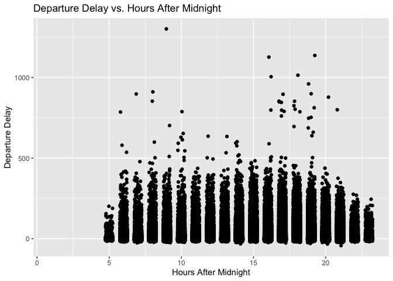
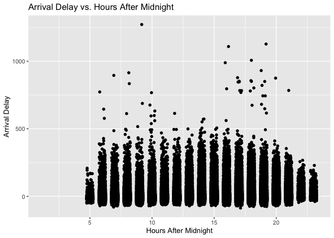
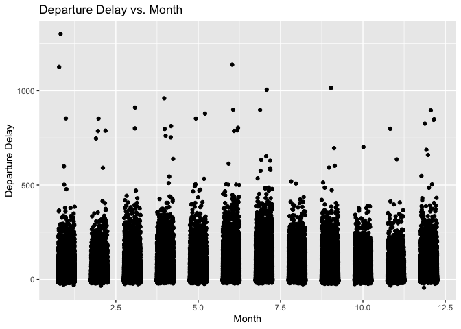
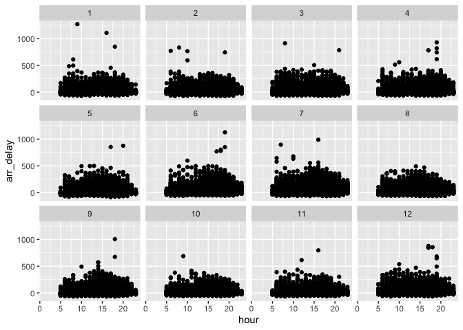

HW3
================
Steven Xia
2/27/2021

``` r
#install.packages("nycflights13")
library(nycflights13)
library(ggplot2)
library(tidyr)
```

In r4ds flights… What time of day should you fly if you want to avoid
delays as much as possible? Does this choice depend on anything? Season?
Weather? Airport? Airline? Find three patterns (“null results” are ok!).
Write your results into Rmarkdown. Include a short introduction that
summarizes the three results. Then, have a section for each finding.
Support each finding with data summaries and visualizations. Include
your code when necessary. This shouldn’t be long, but it might take some
time to find the things you want to talk about and lay them out in an
orderly way.

``` r
head(flights)
```

    ## # A tibble: 6 x 19
    ##    year month   day dep_time sched_dep_time dep_delay arr_time sched_arr_time
    ##   <int> <int> <int>    <int>          <int>     <dbl>    <int>          <int>
    ## 1  2013     1     1      517            515         2      830            819
    ## 2  2013     1     1      533            529         4      850            830
    ## 3  2013     1     1      542            540         2      923            850
    ## 4  2013     1     1      544            545        -1     1004           1022
    ## 5  2013     1     1      554            600        -6      812            837
    ## 6  2013     1     1      554            558        -4      740            728
    ## # … with 11 more variables: arr_delay <dbl>, carrier <chr>, flight <int>,
    ## #   tailnum <chr>, origin <chr>, dest <chr>, air_time <dbl>, distance <dbl>,
    ## #   hour <dbl>, minute <dbl>, time_hour <dttm>

### Part 1 - What time of day should you fly if you want to avoid delays as much as possible?

``` r
ggplot(flights, aes(x = hour, y = dep_delay)) +
  geom_jitter(width = 0.25) + 
  labs(
    x = "Hours After Midnight",
    y = "Departure Delay",
    title = "Departure Delay vs. Hours After Midnight") 
```

<!-- -->

``` r
ggplot(flights, aes(x = hour, y = arr_delay)) +
  geom_jitter(width = 0.25) + 
  labs(
    x = "Hours After Midnight",
    y = "Arrival Delay",
    title = "Arrival Delay vs. Hours After Midnight") 
```

<!-- -->

``` r
ggplot(flights, aes(x = month, y = dep_delay)) +
  geom_jitter(width = 0.25) + 
  labs(
    x = "Month",
    y = "Departure Delay",
    title = "Departure Delay vs. Month") 
```

<!-- -->

``` r
ggplot(flights, aes(x = month, y = arr_delay)) +
  geom_jitter(width = 0.25) + 
  labs(
    x = "Month",
    y = "Arrival Delay",
    title = "Arrival Delay vs. Month") 
```

<!-- -->
