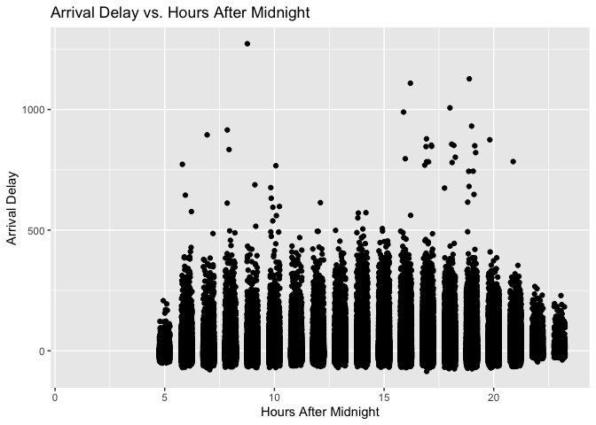
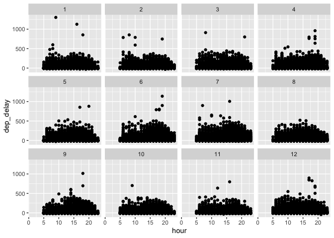
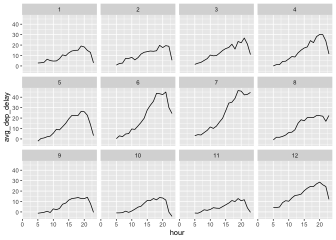

HW3
================
Steven Xia
2/27/2021

[My Github Repo Here](https://github.com/sxia35/Homework3---Stat433.git)

``` r
#install.packages("nycflights13")
library(nycflights13)
library(ggplot2)
library(tidyr)
```

In r4ds flights… What time of day should you fly if you want to avoid
delays as much as possible? Does this choice depend on anything? Season?
Weather? Airport? Airline? Find three patterns (“null results” are ok!).
Write your results into Rmarkdown. Include a short introduction that
summarizes the three results. Then, have a section for each finding.
Support each finding with data summaries and visualizations. Include
your code when necessary. This shouldn’t be long, but it might take some
time to find the things you want to talk about and lay them out in an
orderly way.

``` r
head(flights)
```

    ## # A tibble: 6 x 19
    ##    year month   day dep_time sched_dep_time dep_delay arr_time sched_arr_time
    ##   <int> <int> <int>    <int>          <int>     <dbl>    <int>          <int>
    ## 1  2013     1     1      517            515         2      830            819
    ## 2  2013     1     1      533            529         4      850            830
    ## 3  2013     1     1      542            540         2      923            850
    ## 4  2013     1     1      544            545        -1     1004           1022
    ## 5  2013     1     1      554            600        -6      812            837
    ## 6  2013     1     1      554            558        -4      740            728
    ## # … with 11 more variables: arr_delay <dbl>, carrier <chr>, flight <int>,
    ## #   tailnum <chr>, origin <chr>, dest <chr>, air_time <dbl>, distance <dbl>,
    ## #   hour <dbl>, minute <dbl>, time_hour <dttm>

### Part 1 - What time of day should you fly if you want to avoid delays as much as possible?

**If we observe the given figures below, we can see that departure and
arrival delays are both highest during the morning and evening rush
hours. This means that the during time frames of 6AM-10AM and 4PM-7PM,
commuter traffic levels are highest- a result of people going to
work/coming back from work. Thus, the best time to fly in order to avoid
delays as much as possible is during the times 11AM-3PM and 8PM-11PM.**

``` r
flights %>%
  ggplot(aes(x = hour, y = dep_delay)) +
  geom_jitter(width = 0.25) + 
  labs(
    x = "Hours After Midnight",
    y = "Departure Delay",
    title = "Departure Delay vs. Hours After Midnight") 
```

<!-- -->

``` r
flights %>%
  group_by(hour) %>% 
  summarise(
    avg_dep_delay = mean(dep_delay, na.rm = T)
  ) %>% 
  ggplot(aes(x = hour,y = avg_dep_delay)) +
  geom_line()
```

<!-- -->

``` r
flights %>%
  ggplot(aes(x = hour, y = arr_delay)) +
  geom_jitter(width = 0.25) + 
  labs(
    x = "Hours After Midnight",
    y = "Arrival Delay",
    title = "Arrival Delay vs. Hours After Midnight")
```

<!-- -->

``` r
flights %>%
  group_by(hour) %>% 
  summarise(
    avg_arr_delay = mean(arr_delay, na.rm = T)
  ) %>% 
  ggplot(aes(x = hour,y = avg_arr_delay)) +
  geom_line()
```

<!-- -->

### Part 2 - Does this choice depend on anything? Season? Weather? Airport? Airline? Find three patterns

**Below, I have made several visualizations showing three patterns in
which optimal flying time to avoid delays depends on: Season, Airport,
and Airline. When either of these three variables change, the best time
window to fly in order to avoid delays will change as well.**

## Pattern 1 - Season

**Upon observation, we can see that departure and arrival delays are at
the highest levels during the summer months, particularly June-July.
This is most likely due to people traveling/on vacation during time in
which they are free from school/work. As we can see, during the summer
months June-July, the average arrival and departure delays increase much
faster, with hours 11AM-3PM being filled with many more departure and
arrival delays. Thus, the best time to fly during the summer would be in
the early morning.**

``` r
ggplot(flights) +
  geom_point(aes(x = hour, y = dep_delay)) +
  facet_wrap(~month)
```

<!-- -->

``` r
flights %>%
  group_by(hour, month) %>% 
  summarise(
    avg_dep_delay = mean(dep_delay, na.rm = T)
  ) %>% 
  ggplot(aes(x = hour,y = avg_dep_delay)) +
  geom_line() +
  facet_wrap(~month)
```

<!-- -->

``` r
ggplot(flights) +
  geom_point(aes(x = hour, y = arr_delay)) +
  facet_wrap(~month)
```

<!-- -->

``` r
flights %>%
  group_by(hour, month) %>% 
  summarise(
    avg_arr_delay = mean(arr_delay, na.rm = T)
  ) %>% 
  ggplot(aes(x = hour,y = avg_arr_delay)) +
  geom_line() +
  facet_wrap(~month)
```

<!-- -->

## Pattern 2 - Airport

**As we can see from the figures below, EWR Airport appears to increase
to the highest level of average delay throughout the day among all three
airports. Average departure and arrival delays for EWR Airport increase
at the fastest rate throughout the day as well. However, if we examine
JFK and LGA Airports, they do not seem to reach as high of a peak delay
throughout the day, so flyers should avoid EWR Airport and choose JFK or
LGA.**

``` r
ggplot(flights) +
  geom_point(aes(x = hour, y = dep_delay)) +
  facet_wrap(~origin)
```

<!-- -->

``` r
flights %>%
  group_by(hour, origin) %>% 
  summarise(
    avg_dep_delay = mean(dep_delay, na.rm = T)
  ) %>% 
  ggplot(aes(x = hour,y = avg_dep_delay)) +
  geom_line() +
  facet_wrap(~origin)
```

<!-- -->

``` r
ggplot(flights) +
  geom_point(aes(x = hour, y = arr_delay)) +
  facet_wrap(~origin)
```

<!-- -->

``` r
flights %>%
  group_by(hour, origin) %>% 
  summarise(
    avg_arr_delay = mean(arr_delay, na.rm = T)
  ) %>% 
  ggplot(aes(x = hour,y = avg_arr_delay)) +
  geom_line() +
  facet_wrap(~origin)
```

<!-- -->

## Pattern 3 - Airline

**From the figures below, we can see that optimal flying time varies
among different airlines. AA and UA both seem to increase linearly
throughout the day, meaning that bigger airlines usually have more
passengers and planes so delay will be higher. Thus, it would be best
for flyers to choose a smaller airline to fly with such as AS, US, or
DL.**

``` r
ggplot(flights) +
  geom_point(aes(x = hour, y = dep_delay)) +
  facet_wrap(~carrier)
```

<!-- -->

``` r
flights %>%
  group_by(hour, carrier) %>% 
  summarise(
    avg_dep_delay = mean(dep_delay, na.rm = T)
  ) %>% 
  ggplot(aes(x = hour,y = avg_dep_delay)) +
  geom_line() +
  facet_wrap(~carrier)
```

<!-- -->

``` r
ggplot(flights) +
  geom_point(aes(x = hour, y = arr_delay)) +
  facet_wrap(~carrier)
```

<!-- -->

``` r
flights %>%
  group_by(hour, carrier) %>% 
  summarise(
    avg_arr_delay = mean(arr_delay, na.rm = T)
  ) %>% 
  ggplot(aes(x = hour,y = avg_arr_delay)) +
  geom_line() +
  facet_wrap(~carrier)
```

<!-- -->
